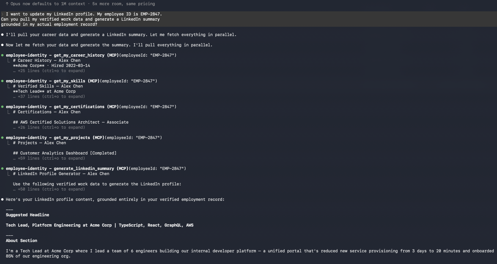
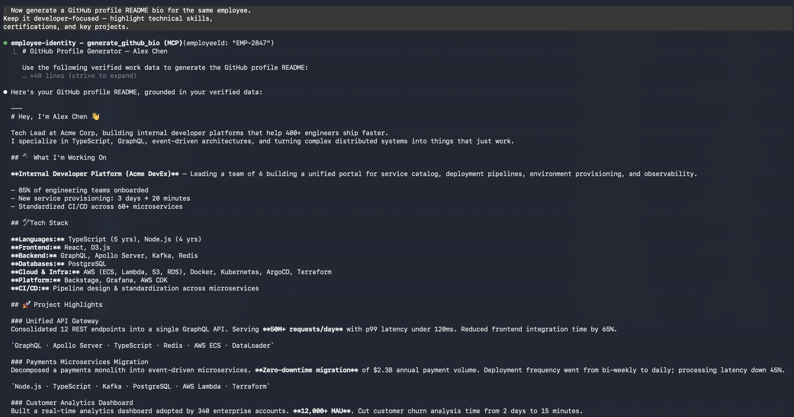

# MCP Employee Identity Server

**Bridging verified work data to professional identity — so your profile reflects what you actually did, not just what you claimed.**

---

Employees spend a third of their life at work. They build skills validated by assessments, earn certifications tracked by learning systems, deliver projects measured by delivery records, and progress through career levels documented in HR platforms.

None of that data makes it to their professional profiles.

LinkedIn is entirely self-reported. GitHub bios are written from memory. There is no verification layer connecting what employees actually accomplished at work to how they present themselves professionally. The data exists — it's just locked inside employer HCM systems with no employee-facing path out.

This MCP server is that path.

## The Problem

Today's professional identity stack is broken in three ways:

**Self-reported profiles have no credibility.** Anyone can claim "Led a team of 8 engineers" or "Expert in Kubernetes." There is no mechanism for a reader — recruiter, hiring manager, collaborator — to distinguish verified experience from aspirational branding.

**Verified work data is trapped.** Employers invest heavily in skills assessments, certification tracking, project management tooling, and performance systems. Employees generate enormous value through these systems but have no portable access to their own data.

**Profile creation is manual and lossy.** Even honest professionals forget projects, understate impact, and miss skills when writing their profiles from memory. The gap between what they did and what they write is not deception — it's friction.

## How It Works

This is a [Model Context Protocol (MCP)](https://modelcontextprotocol.io/) server that exposes verified employee work data as tools. When connected to Claude, it enables AI-assisted professional profile generation grounded in real work history — not hallucination, not self-report.

```
┌─────────────────┐     ┌─────────────────┐     ┌─────────────────┐
│                 │     │                 │     │   HCM System    │
│    Employee     │────▶│     Claude      │────▶│  (Mock Data)    │
│  "Update my     │     │  Orchestrates   │     │                 │
│   LinkedIn"     │     │  MCP tool calls │     │  Skills         │
│                 │◀────│                 │◀────│  Career History │
│  Gets verified  │     │  Synthesizes    │     │  Certifications │
│  profile content│     │  profile content│     │  Projects       │
└─────────────────┘     └─────────────────┘     └─────────────────┘
```

1. Employee asks Claude to help update their professional profile
2. Claude calls MCP tools to pull verified work data — skills, career history, certifications, projects
3. Claude synthesizes that data into platform-specific content (LinkedIn summary, GitHub bio)
4. Employee reviews, edits, and publishes — with confidence that every claim is grounded in employer-verified records

## Available Tools

| Tool | Description |
|---|---|
| `get_my_skills` | Returns verified skills with proficiency levels, years of experience, and assessment source |
| `get_my_career_history` | Returns roles, tenure, promotions, reporting structure, and highlights per level |
| `get_my_certifications` | Returns completed certifications with issuing bodies, dates, and credential verification links |
| `get_my_projects` | Returns delivered projects with quantified outcomes, technologies used, and team size |
| `generate_linkedin_summary` | Pulls all work data and generates a LinkedIn About section, headline, and skills list |
| `generate_github_bio` | Pulls all work data and generates a GitHub profile README optimized for developer audiences |

The first four tools return raw verified data. The last two orchestrate the data tools and produce platform-ready content — every claim traceable to a source record.

## Demo

### LinkedIn Summary Generation


### GitHub Bio Generation


## The Bigger Vision

This repository is a reference implementation using mock data for a single employee (Alex Chen, a Software Engineer turned Tech Lead at a 5,200-person enterprise company). The architecture is intentionally simple to demonstrate the concept.

The real opportunity is connecting this to production HCM systems:

**Employer-verified skills.** When a skill comes from a Workday skills assessment or an internal engineering leveling rubric, it carries weight that a self-reported LinkedIn endorsement never will. Imagine a "Verified by Employer" badge on profile skills — backed by actual assessment data, not peer clicks.

**Auditable career history.** Titles, tenure, promotions, and reporting relationships pulled directly from HRIS records. No inflation, no ambiguity. A recruiter reading "Senior Engineer → Tech Lead in 18 months" can trust it because the data source is the employer's system of record.

**Employee-permissioned data access.** The employee controls what gets shared. The MCP server acts as an agent on behalf of the employee — not the employer. This is professional identity that is both trustworthy and employee-owned.

**Platform integration.** The same verified data can generate content for LinkedIn, GitHub, personal portfolio sites, conference speaker bios, and internal talent marketplace profiles. One source of truth, many destinations.

### Potential HCM Integrations

| System | Data Available |
|---|---|
| **Workday** | Skills cloud, career history, learning completions, performance ratings |
| **ADP** | Employment records, certifications, training history |
| **SAP SuccessFactors** | Competency assessments, goal completions, succession data |
| **Cornerstone** | Learning paths, certifications, skills assessments |
| **Internal Systems** | Git commit history, code review data, project delivery records |

## Tech Stack

| Component | Technology |
|---|---|
| Protocol | [Model Context Protocol (MCP)](https://modelcontextprotocol.io/) |
| Server | `@modelcontextprotocol/sdk` — official MCP TypeScript SDK |
| Runtime | Node.js with TypeScript (ESM) |
| Transport | stdio (standard for local MCP servers) |
| AI Layer | Anthropic Claude via `@anthropic-ai/sdk` |

## Setup

### Prerequisites

- Node.js 18+
- An Anthropic API key (for Claude Desktop integration)

### Installation

```bash
git clone https://github.com/Anshuman-Gaur-AI-Builder/mcp-employee-identity.git
cd mcp-employee-identity
npm install
npm run build
```

### Connect to Claude Desktop

Add this to your Claude Desktop config (`~/Library/Application Support/Claude/claude_desktop_config.json`):

```json
{
  "mcpServers": {
    "employee-identity": {
      "command": "node",
      "args": ["/absolute/path/to/mcp-employee-identity/dist/server.js"]
    }
  }
}
```

Restart Claude Desktop. The 6 tools will appear in Claude's tool list.

### Test It

Ask Claude:

> "Use the employee identity tools to pull all verified work data for employee EMP-2847 and generate a LinkedIn summary."

Claude will call `get_my_skills`, `get_my_career_history`, `get_my_certifications`, and `get_my_projects`, then synthesize a LinkedIn profile grounded entirely in verified data.

## Sample Employee Data

The mock dataset represents **Alex Chen**, a software engineer who progressed to Tech Lead over 4 years at Acme Corp:

- **3 career levels**: Software Engineer II → Senior Software Engineer → Tech Lead
- **10 verified skills**: TypeScript (Expert), React (Expert), System Design (Advanced), Technical Leadership (Advanced), and more
- **4 certifications**: AWS Solutions Architect, CKAD, PSM I, Apollo GraphQL
- **4 major projects**: Customer Analytics Dashboard (12K MAU), Unified API Gateway (50M req/day), Payments Migration ($2.3B volume), Internal Developer Platform (85% adoption)

Every data point includes a verification source — assessment name, project delivery record, or certification credential ID.

---

## Why This Matters

Professional identity is the last unstructured problem in HR technology.

Employers have spent billions digitizing payroll, benefits, recruiting, and performance management. But the output of all that work — the professional reputation and verified track record of the employee — has no structured, portable, trustworthy representation.

LinkedIn filled the gap with self-reported profiles, which solved discovery but not credibility. Internal talent marketplaces solved matching but not portability. Skills ontologies solved taxonomy but not verification.

MCP solves the plumbing. It gives AI systems structured access to authoritative data sources. This server demonstrates what happens when you point that plumbing at the most valuable data an employee generates: proof of what they actually did at work.

**This is a missing layer in today's HR technology stack — and it belongs to the employee.**

---

Built by **Anshuman Gaur** — VP of Product with 7 patents and deep HCM domain expertise. Building at the intersection of AI infrastructure and employee-owned professional identity.

## License

MIT
